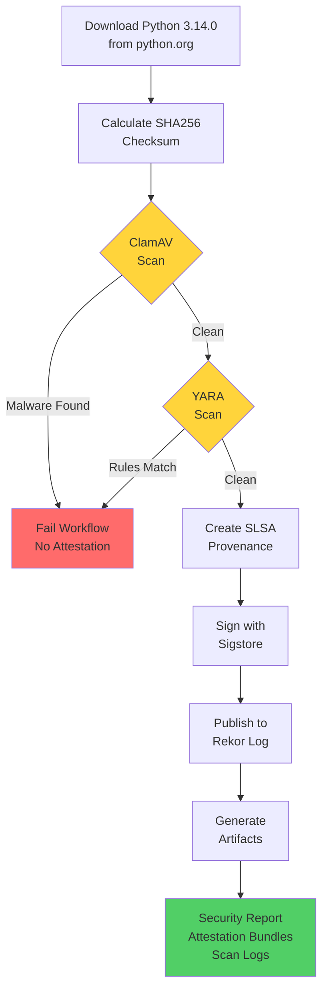
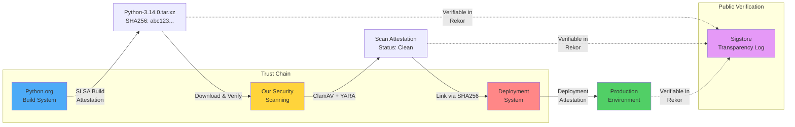

# Security Attestation Report: Python Executable Download and Scanning

## The Problem

Look, downloading software from the internet is sketchy, even from places we trust like python.org. Here's what keeps security teams up at night:

1. **Trust Verification**: How do we actually know the file we downloaded is the same one that left python.org's servers?
2. **Malware Detection**: How do we make sure we're not about to install something nasty?
3. **Audit Trail**: When an auditor shows up six months later asking "prove you scanned this," what do we show them?
4. **Supply Chain Security**: How do we track where our software came from and what happened to it?

The old way - manual checks and screenshots in a wiki somewhere - doesn't cut it anymore. We need something automated that actually proves we did what we said we did.

## What We Built

We put together an automated pipeline that does the heavy lifting:

1. Grabs Python 3.14.0 from python.org
2. Runs it through real malware scanners
3. Creates cryptographic proof that all this actually happened
4. Posts everything to a public log so anyone can verify it

The whole thing runs in GitHub Actions and spits out artifacts that'll still be verifiable years from now.

## Workflow Overview



## How It Works

### Step 1: Secure Download

First, we download `Python-3.14.0.tar.xz` straight from `https://www.python.org/ftp/python/3.14.0/` and calculate its SHA256 hash right away. This hash is basically the file's fingerprint - it'll stay the same throughout everything we do.

```
File: Python-3.14.0.tar.xz
SHA256: [calculated checksum]
Source: https://www.python.org/ftp/python/3.14.0/Python-3.14.0.tar.xz
```

### Step 2: ClamAV Virus Scanning

We throw the file at ClamAV using their official Docker image (`clamav/clamav:stable`).

**Why ClamAV?**
- It's the real deal - enterprises actually use this
- Cisco Talos keeps it updated with new virus definitions daily
- Open source, so we know what it's doing
- Free, which doesn't hurt

**Here's what we run:**
```bash
docker run --rm \
  -v $(pwd):/scan:ro \
  clamav/clamav:stable \
  clamscan --infected --recursive --bell /scan/Python-3.14.0.tar.xz
```

**What the exit codes mean:**
- 0 = You're good, nothing found
- 1 = Uh oh, found something bad (and the workflow dies)

**What we get back:**
```json
{
  "status": "clean",
  "file": "Python-3.14.0.tar.xz",
  "threats_found": 0,
  "exit_code": 0
}
```

If ClamAV finds anything suspicious, we bail immediately. No attestation, no passing go.

### Step 3: YARA Rule-Based Scanning

YARA lets us write custom rules to look for weird patterns that virus scanners might miss. We check for:

- Sketchy executable patterns
- Known malware families
- Backdoor signatures
- Hidden nasties in compressed files

**Our custom rules:**
- `Python_Executable_Check`: Makes sure it looks like legit Python code
- `Malware_Signature_Test`: Looks for common malware strings
- `Compressed_Archive_Check`: Checks for suspicious stuff in the tarball

**Command:**
```bash
yara -s -w yara-rules/test-rules.yar Python-3.14.0.tar.xz
```

**Output:**
```json
{
  "status": "clean",
  "file": "Python-3.14.0.tar.xz",
  "matches": 0,
  "rules_applied": "test-rules.yar",
  "exit_code": 0
}
```

Same as ClamAV - any matches and we're done.

## What We Attest

Once everything passes, we create two signed attestations with Sigstore:

### Attestation 1: Python Executable Provenance

This one proves:
- **What**: The exact file (Python-3.14.0.tar.xz with its SHA256)
- **Where**: python.org's FTP server
- **When**: Timestamp of when we grabbed it
- **Who**: Our GitHub Actions workflow
- **How**: Automated download via wget

**The format (SLSA Provenance):**
```json
{
  "buildType": "https://github.com/naveensrinivasan/release-dir-list/python-download",
  "builder": {
    "id": "https://github.com/actions/runner"
  },
  "buildDefinition": {
    "externalParameters": {
      "source": "https://www.python.org/ftp/python/3.14.0/Python-3.14.0.tar.xz"
    },
    "internalParameters": {
      "repository": "naveensrinivasan/release-dir-list",
      "workflow": "Security Scan and Attestation POC",
      "run_id": "[unique-run-id]"
    }
  }
}
```

### Attestation 2: Security Scan Results Provenance

This one proves we actually scanned the thing:
- **What Got Scanned**: Python-3.14.0.tar.xz (with its checksum)
- **ClamAV Says**: Clean
- **YARA Says**: Clean
- **When**: Scan timestamp
- **Tools**: ClamAV stable + YARA with our custom rules
- **Context**: Which repo, which run, all the details

**Same format:**
```json
{
  "buildType": "https://github.com/naveensrinivasan/release-dir-list/security-scan",
  "builder": {
    "id": "https://github.com/actions/runner"
  },
  "buildDefinition": {
    "externalParameters": {
      "target": "Python-3.14.0.tar.xz",
      "source": "https://www.python.org/ftp/python/3.14.0/Python-3.14.0.tar.xz"
    },
    "internalParameters": {
      "clamav_status": "clean",
      "yara_status": "clean",
      "repository": "naveensrinivasan/release-dir-list",
      "workflow_run_id": "[unique-run-id]"
    }
  }
}
```

## How Attestations Are Signed

We're using Sigstore - it's a Linux Foundation project that's actually pretty clever:

1. **No Keys to Lose**: Uses GitHub OIDC tokens instead of managing private keys
2. **Public Record**: Everything goes into Rekor (their transparency log at rekor.sigstore.dev)
3. **Real Certificates**: Short-lived certs from Fulcio CA
4. **Timestamps**: Trusted timestamps that prove when things happened

**What we run:**
```bash
cosign attest-blob --yes \
  --predicate python-predicate.json \
  --type slsaprovenance \
  --bundle python-3.14.0-attestation.bundle \
  Python-3.14.0.tar.xz
```

**What actually happens:**
1. GitHub Actions gives us an OIDC token proving who we are
2. Sigstore's CA hands us a short-lived certificate
3. We sign the attestation with that cert
4. Signature gets published to the public transparency log
5. We get a bundle with everything: signature, cert, timestamp, log entry

## Verification Process

Here's the cool part - anyone can check our work without trusting us:

```bash
cosign verify-blob-attestation \
  --bundle python-3.14.0-attestation.bundle \
  --type slsaprovenance \
  --certificate-identity-regexp=".*" \
  --certificate-oidc-issuer="https://token.actions.githubusercontent.com" \
  Python-3.14.0.tar.xz
```

**What this checks:**
1. The certificate came from Sigstore's trusted CA
2. The certificate was actually valid when we used it
3. The signature matches the file
4. It really came from GitHub Actions
5. There's a matching entry in the transparency log

## Proof of Scanning

The security report (`security-scan-report-{run_id}.json`) has everything an auditor could want:

```json
{
  "security_scan_report": {
    "report_id": "scan-[workflow-run-id]",
    "timestamp": "2024-10-15T12:00:00Z",
    "target_file": {
      "name": "Python-3.14.0.tar.xz",
      "sha256": "[calculated-checksum]"
    },
    "scan_results": {
      "clamav_scan": {
        "status": "clean",
        "threats_found": 0
      },
      "yara_scan": {
        "status": "clean",
        "matches": 0
      }
    },
    "attestation_results": {
      "python_executable": {
        "status": "attested",
        "bundle_file": "python-3.14.0-attestation.bundle"
      },
      "scan_results": {
        "status": "attested",
        "bundle_file": "scan-results-attestation.bundle"
      }
    },
    "tools_used": {
      "clamav": {
        "source": "Docker image",
        "image": "clamav/clamav:stable",
        "provider": "Cisco Talos"
      },
      "yara": {
        "source": "Native Ubuntu package"
      },
      "cosign": {
        "version": "v2.4.0",
        "provider": "Sigstore"
      }
    }
  }
}
```

## Why This Matters

### 1. Compliance and Audit

When auditors show up, you can actually prove:
- Yeah, we scanned it before deploying
- We used real industry-standard tools
- The results are cryptographically verifiable (not just screenshots)
- There's a complete trail in public logs

### 2. Supply Chain Security

The attestations give you:
- A chain of custody from the original source
- Proof the file hasn't been tampered with
- A public record anyone can check
- The ability to verify independently

### 3. Incident Response

When something goes wrong six months later:
- Pull up the original scan results from the transparency log
- See exactly which version got deployed
- Trace it back to where it came from
- Show you did your homework

### 4. Zero Trust Architecture

This enables:
- "Never trust, always verify" (for real, not just on slides)
- Cryptographic proof instead of policy documents
- Automated enforcement
- Transparency without exposing your infrastructure

## Artifacts Available

Every run creates downloadable files:

1. **security-scan-report-{run_id}.json**: The full audit report
2. **python-predicate.json**: SLSA provenance for the Python file
3. **scan-predicate.json**: SLSA provenance for scan results
4. **python-3.14.0-attestation.bundle**: The signature bundle
5. **scan-results-attestation.bundle**: Scan results signature
6. **clamav-scan.log**: Raw ClamAV output
7. **yara-scan.log**: Raw YARA output

## Verification Instructions

Want to check our work? Here's how:

1. Download the bundles and Python file
2. Verify the Python executable attestation:
   ```bash
   cosign verify-blob-attestation \
     --bundle python-3.14.0-attestation.bundle \
     --type slsaprovenance \
     --certificate-oidc-issuer="https://token.actions.githubusercontent.com" \
     Python-3.14.0.tar.xz
   ```

3. Verify the scan results attestation:
   ```bash
   cosign verify-blob-attestation \
     --bundle scan-results-attestation.bundle \
     --type slsaprovenance \
     --certificate-oidc-issuer="https://token.actions.githubusercontent.com" \
     scan-results.json
   ```

4. Check the transparency log:
   - Go to https://rekor.sigstore.dev
   - Search by file hash or certificate
   - Make sure the entry matches what we say

## Conclusion

This proof-of-concept shows you can actually build verifiable security processes with modern tools. We combined ClamAV and YARA for malware scanning with Sigstore for cryptographic proof, creating a system where:

- Scans happen automatically
- Results get cryptographically signed
- Signatures go into public logs
- Anyone can verify what we're claiming
- You get a complete audit trail for compliance

The real shift here is from "trust us, we follow the process" to "here's cryptographic proof we did what we said." You're not showing auditors documentation anymore - you're showing them math.

## Future Enhancement: Python.org Native Attestations

Right now we're creating attestations about Python releases we download. But here's where it gets even better: eventually, Python.org will likely start signing their own releases with Sigstore.

**When that happens, we'll have a complete chain of trust:**

1. **Python.org's Attestation**: "We, the Python Software Foundation, built and released Python-3.14.0.tar.xz"
   - Proves who built it
   - Proves the build environment
   - Provides SLSA provenance from their build system

2. **Our Security Scan Attestation**: "We downloaded that file and scanned it clean"
   - Verifies we got the right file (matching hash)
   - Proves we ran malware scans
   - Links our attestation to their attestation

3. **Your Deployment Attestation**: "We deployed the scanned version"
   - Proves what went to production
   - Links back to both attestations
   - Creates complete audit trail

**Why this matters:**

Instead of just trusting python.org's website, you'd have:
- Cryptographic proof the file came from Python's official build
- Independent verification it passed security scanning
- A complete chain from source code to production

**The layered security model:**



**How the chain works:**
1. Python.org attests: "We built this at commit X with these dependencies"
2. We attest: "We verified the hash matches and scanned it clean"
3. You attest: "We deployed this exact version to production"
4. Anyone can verify: Check all three attestations in Rekor, linking them by SHA256

This is where software supply chain security is heading - multiple attestations from different parties, all independently verifiable, all building trust through cryptography instead of hope.

## Technical References

- **ClamAV**: https://docs.clamav.net/
- **YARA**: https://yara.readthedocs.io/
- **Sigstore**: https://docs.sigstore.dev/
- **SLSA**: https://slsa.dev/
- **Rekor Transparency Log**: https://rekor.sigstore.dev/

---

**Repository**: naveensrinivasan/release-dir-list  
**Workflow**: Security Scan and Attestation POC  
**Status**: Verified and Attested