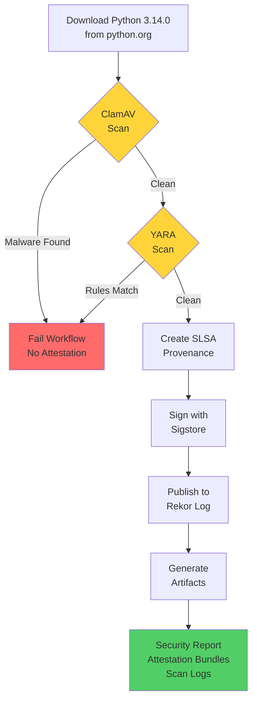
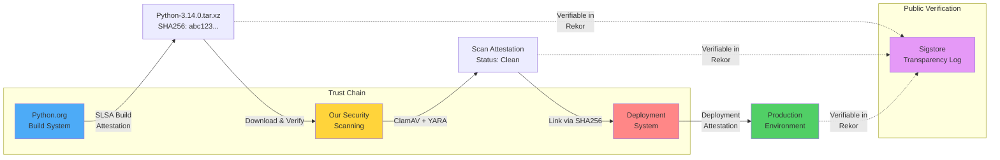

# Security Attestation Report: Python Executable Download and Scanning

## The Problem

Downloading software from the internet creates real security risks, even from trusted sources like python.org. Organizations face several challenges:

1. **Trust Verification**: Confirming the downloaded file matches what the source provided
2. **Malware Detection**: Ensuring files are free from malicious code before deployment
3. **Audit Trail**: Providing cryptographic proof that security scans were performed
4. **Supply Chain Security**: Tracking software provenance throughout the infrastructure

Manual verification processes don't scale and lack verifiable proof. Automated systems with cryptographic attestation solve both problems.

## What We Built

This automated pipeline provides:

1. Download of Python 3.14.0 from python.org
2. Scanning with production-grade malware detection tools
3. Cryptographic attestation of scan results
4. Publication to public transparency logs

The system runs in GitHub Actions and generates artifacts with long-term verifiability.

## Workflow Overview



## How It Works

### Step 1: Download and Scan

The workflow downloads `Python-3.14.0.tar.xz` from `https://www.python.org/ftp/python/3.14.0/` and scans it immediately. SHA256 hash calculation provides file identification in reports and attestations. Security validation comes from malware scanning, not hash verification.

### Step 2: ClamAV Virus Scanning

Scanning uses the official ClamAV Docker image (`clamav/clamav:stable`).

**Why ClamAV:**
- Industry-standard antivirus used in enterprise environments
- Daily virus definition updates from Cisco Talos
- Open source with transparent operation
- No licensing costs

**Here's what we run:**
```bash
docker run --rm \
  -v $(pwd):/scan:ro \
  clamav/clamav:stable \
  clamscan --infected --recursive --bell /scan/Python-3.14.0.tar.xz
```

**Exit codes:**
- 0 = Clean, no threats found
- 1 = Threats detected (workflow fails immediately)

**What we get back:**
```json
{
  "status": "clean",
  "file": "Python-3.14.0.tar.xz",
  "threats_found": 0,
  "exit_code": 0
}
```

Detection of threats causes immediate workflow failure. No attestation is generated for files with detected threats.

### Step 3: YARA Rule-Based Scanning

YARA provides pattern-based detection beyond traditional signature matching. Custom rules check for:

- Suspicious executable patterns
- Known malware families
- Backdoor signatures
- Malicious content in compressed files

**Our custom rules:**
- `Python_Executable_Check`: Makes sure it looks like legit Python code
- `Malware_Signature_Test`: Looks for common malware strings
- `Compressed_Archive_Check`: Checks for suspicious stuff in the tarball

**Command:**
```bash
yara -s -w yara-rules/test-rules.yar Python-3.14.0.tar.xz
```

**Output:**
```json
{
  "status": "clean",
  "file": "Python-3.14.0.tar.xz",
  "matches": 0,
  "rules_applied": "test-rules.yar",
  "exit_code": 0
}
```

Like ClamAV, any YARA rule matches cause the workflow to fail.

## What We Attest

Once everything passes, we create two signed attestations with Sigstore:

### Attestation 1: Python Executable Provenance

Attestation contents:
- **What**: Python-3.14.0.tar.xz (identified by SHA256 hash)
- **Where**: python.org FTP server
- **When**: Download timestamp
- **Who**: GitHub Actions workflow
- **How**: Automated download via wget

The SHA256 serves as a file identifier, not a verification mechanism.

**The format (SLSA Provenance):**
```json
{
  "buildType": "https://github.com/naveensrinivasan/release-dir-list/python-download",
  "builder": {
    "id": "https://github.com/actions/runner"
  },
  "buildDefinition": {
    "externalParameters": {
      "source": "https://www.python.org/ftp/python/3.14.0/Python-3.14.0.tar.xz"
    },
    "internalParameters": {
      "repository": "naveensrinivasan/release-dir-list",
      "workflow": "Security Scan and Attestation POC",
      "run_id": "[unique-run-id]"
    }
  }
}
```

### Attestation 2: Security Scan Results Provenance

Scan attestation contents:
- **Target**: Python-3.14.0.tar.xz (identified by SHA256)
- **ClamAV Result**: Clean
- **YARA Result**: Clean
- **Timestamp**: Scan completion time
- **Tools**: ClamAV stable + YARA with custom rules
- **Context**: Repository, workflow run ID, execution details

**Same format:**
```json
{
  "buildType": "https://github.com/naveensrinivasan/release-dir-list/security-scan",
  "builder": {
    "id": "https://github.com/actions/runner"
  },
  "buildDefinition": {
    "externalParameters": {
      "target": "Python-3.14.0.tar.xz",
      "source": "https://www.python.org/ftp/python/3.14.0/Python-3.14.0.tar.xz"
    },
    "internalParameters": {
      "clamav_status": "clean",
      "yara_status": "clean",
      "repository": "naveensrinivasan/release-dir-list",
      "workflow_run_id": "[unique-run-id]"
    }
  }
}
```

## How Attestations Are Signed

Sigstore (Linux Foundation project) provides:

1. **No Keys to Lose**: Uses GitHub OIDC tokens instead of managing private keys
2. **Public Record**: Everything goes into Rekor (their transparency log at rekor.sigstore.dev)
3. **Real Certificates**: Short-lived certs from Fulcio CA
4. **Timestamps**: Trusted timestamps that prove when things happened

**What we run:**
```bash
cosign attest-blob --yes \
  --predicate python-predicate.json \
  --type slsaprovenance \
  --bundle python-3.14.0-attestation.bundle \
  Python-3.14.0.tar.xz
```

**Signing process:**
1. GitHub Actions provides OIDC token for identity verification
2. Sigstore's Fulcio CA issues short-lived certificate
3. Attestation signing using the certificate
4. Publication to Rekor transparency log
5. Bundle generation containing signature, certificate, timestamp, and log entry

## Verification Process

Independent verification without trust requirements:

```bash
cosign verify-blob-attestation \
  --bundle python-3.14.0-attestation.bundle \
  --type slsaprovenance \
  --certificate-identity-regexp=".*" \
  --certificate-oidc-issuer="https://token.actions.githubusercontent.com" \
  Python-3.14.0.tar.xz
```

**What this checks:**
1. The certificate came from Sigstore's trusted CA
2. The certificate was actually valid when we used it
3. The signature matches the file
4. It really came from GitHub Actions
5. There's a matching entry in the transparency log

## Proof of Scanning

The security report (`security-scan-report-{run_id}.json`) has everything an auditor could want:

```json
{
  "security_scan_report": {
    "report_id": "scan-[workflow-run-id]",
    "timestamp": "2024-10-15T12:00:00Z",
    "target_file": {
      "name": "Python-3.14.0.tar.xz",
      "sha256": "[calculated-checksum]"
    },
    "scan_results": {
      "clamav_scan": {
        "status": "clean",
        "threats_found": 0
      },
      "yara_scan": {
        "status": "clean",
        "matches": 0
      }
    },
    "attestation_results": {
      "python_executable": {
        "status": "attested",
        "bundle_file": "python-3.14.0-attestation.bundle"
      },
      "scan_results": {
        "status": "attested",
        "bundle_file": "scan-results-attestation.bundle"
      }
    },
    "tools_used": {
      "clamav": {
        "source": "Docker image",
        "image": "clamav/clamav:stable",
        "provider": "Cisco Talos"
      },
      "yara": {
        "source": "Native Ubuntu package"
      },
      "cosign": {
        "version": "v2.4.0",
        "provider": "Sigstore"
      }
    }
  }
}
```

## Why This Matters

### 1. Compliance and Audit

Audit evidence includes:
- Cryptographic proof of pre-deployment scanning
- Use of industry-standard security tools
- Verifiable results (not documentation or screenshots)
- Complete trail in public transparency logs

### 2. Supply Chain Security

The attestations give you:
- A chain of custody from the original source
- Proof the file hasn't been tampered with
- A public record anyone can check
- The ability to verify independently

### 3. Incident Response

Incident response capabilities:
- Retrieve original scan results from transparency log
- Identify deployed version precisely
- Trace provenance to original source
- Demonstrate due diligence

### 4. Zero Trust Architecture

Zero trust capabilities:
- Verification over trust
- Cryptographic proof instead of policy documentation
- Automated policy enforcement
- Transparency without infrastructure exposure

## Artifacts Available

Every run creates downloadable files:

1. **security-scan-report-{run_id}.json**: The full audit report
2. **python-predicate.json**: SLSA provenance for the Python file
3. **scan-predicate.json**: SLSA provenance for scan results
4. **python-3.14.0-attestation.bundle**: The signature bundle
5. **scan-results-attestation.bundle**: Scan results signature
6. **clamav-scan.log**: Raw ClamAV output
7. **yara-scan.log**: Raw YARA output

## Verification Instructions

Want to check our work? Here's how:

1. Download the bundles and Python file
2. Verify the Python executable attestation:
   ```bash
   cosign verify-blob-attestation \
     --bundle python-3.14.0-attestation.bundle \
     --type slsaprovenance \
     --certificate-oidc-issuer="https://token.actions.githubusercontent.com" \
     Python-3.14.0.tar.xz
   ```

3. Verify the scan results attestation:
   ```bash
   cosign verify-blob-attestation \
     --bundle scan-results-attestation.bundle \
     --type slsaprovenance \
     --certificate-oidc-issuer="https://token.actions.githubusercontent.com" \
     scan-results.json
   ```

4. Check the transparency log:
   - Go to https://rekor.sigstore.dev
   - Search by file hash or certificate
   - Make sure the entry matches what we say

## Conclusion

This proof-of-concept shows you can actually build verifiable security processes with modern tools. We combined ClamAV and YARA for malware scanning with Sigstore for cryptographic proof, creating a system where:

- Scans happen automatically
- Results get cryptographically signed
- Signatures go into public logs
- Anyone can verify what we're claiming
- You get a complete audit trail for compliance

The approach shifts from process trust to cryptographic verification. Audits rely on verifiable evidence rather than documentation.

## Future Enhancement: Python.org Native Attestations

Current implementation creates attestations for downloaded Python releases. Future enhancement: Python.org signing their releases with Sigstore.

**Complete chain of trust:**

1. **Python.org's Attestation**: "We, the Python Software Foundation, built and released Python-3.14.0.tar.xz"
   - Proves who built it
   - Proves the build environment
   - Provides SLSA provenance from their build system

2. **Our Security Scan Attestation**: "We downloaded that file and scanned it clean"
   - Verifies we got the right file (matching hash)
   - Proves we ran malware scans
   - Links our attestation to their attestation

3. **Your Deployment Attestation**: "We deployed the scanned version"
   - Proves what went to production
   - Links back to both attestations
   - Creates complete audit trail

**Benefits:**

Multiple layers of cryptographic verification:
- Proof of official Python build origin
- Independent security scan verification
- Complete chain from source to production

**The layered security model:**



**How the chain works:**
1. Python.org attests: "We built this at commit X with these dependencies"
2. We attest: "We downloaded this file and scanned it clean"
3. You attest: "We deployed this exact version to production"
4. Anyone can verify: Check all three attestations in Rekor, linking them by SHA256 hash

Software supply chain security evolves toward multiple independent attestations from different parties, each cryptographically verifiable.

## Technical References

- **ClamAV**: https://docs.clamav.net/
- **YARA**: https://yara.readthedocs.io/
- **Sigstore**: https://docs.sigstore.dev/
- **SLSA**: https://slsa.dev/
- **Rekor Transparency Log**: https://rekor.sigstore.dev/

---

**Repository**: naveensrinivasan/release-dir-list  
**Workflow**: Security Scan and Attestation POC  
**Status**: Verified and Attested