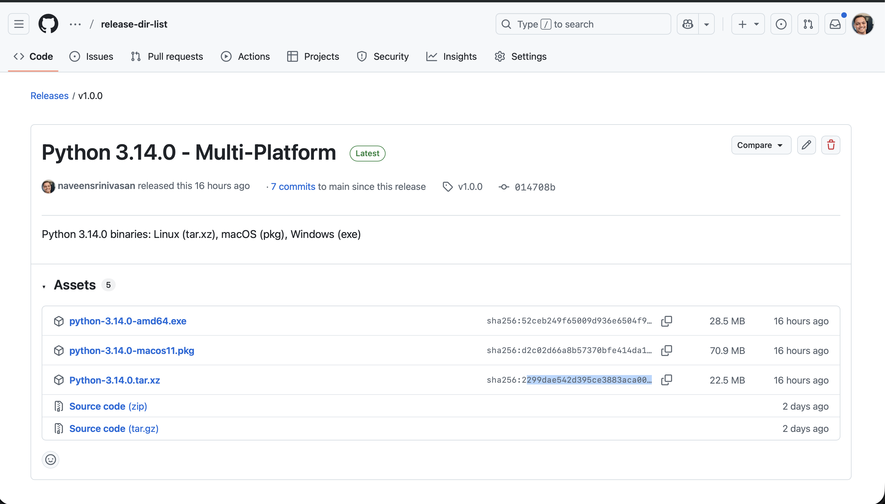
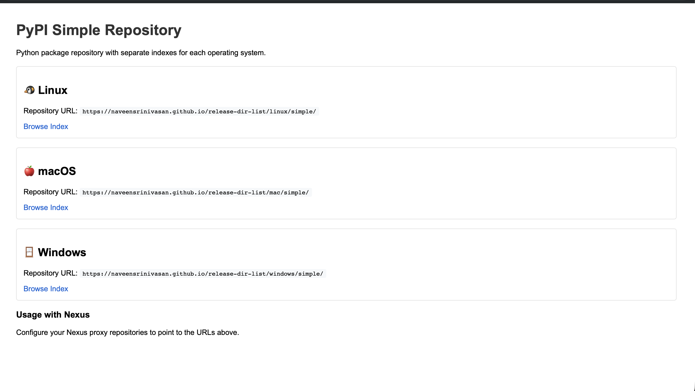
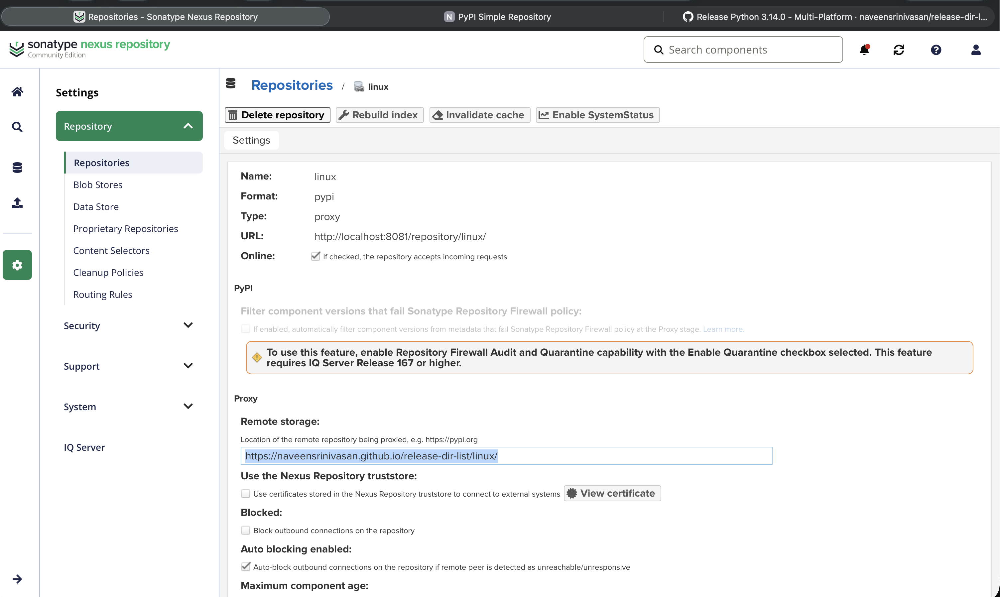

# PyPI Repository Spike Results


We successfully implemented a proof-of-concept solution that enables hosting Python package downloads from GitHub releases and serving them through a Nexus-friendly PyPI repository structure via GitHub Pages. The spike demonstrates a complete end-to-end workflow from GitHub releases to Nexus Repository Manager integration.

## Key Achievements

### GitHub Releases Integration
- Successfully hosted Python 3.14.0 binaries on GitHub releases
- Release URL: [https://github.com/naveensrinivasan/release-dir-list/releases/tag/v1.0.0](https://github.com/naveensrinivasan/release-dir-list/releases/tag/v1.0.0)
- Supports multiple platforms: Linux (tar.xz), macOS (pkg), Windows (exe)


_Release assets hosted on GitHub Releases_

### Automated GitHub Actions Workflow
- Implemented `.github/workflows/pypi-from-releases.yml`
- Automatically triggers on new releases
- Downloads release assets and calculates SHA256 checksums
- Generates PyPI Simple repository HTML structure
- Deploys to GitHub Pages automatically

### GitHub Pages PyPI Repository
- Successfully deployed PyPI-compatible repository to GitHub Pages
- Repository URL: [https://naveensrinivasan.github.io/release-dir-list/linux/](https://naveensrinivasan.github.io/release-dir-list/linux/)
- Follows PEP 503 PyPI Simple Repository API specification
- Separate repositories for each platform (Linux, macOS, Windows)


_Generated PyPI Simple repository on GitHub Pages_

### Nexus Repository Manager Integration
- Successfully configured local Nexus instance as PyPI proxy
- Proxy repository points to GitHub Pages PyPI repository
- Verified end-to-end package downloads through Nexus
- Confirmed caching and serving functionality


_Example Nexus pypi (proxy) configuration pointing to GitHub Pages_


### Generated Repository Structure
```
/linux/simple/
├── index.html                    # Root index
└── python/
    └── index.html                # Package index with download links
```

## Validation Results

### 1. Release Asset Hosting
- Python 3.14.0 binaries successfully uploaded to GitHub releases
- Multiple platform support verified
- Asset downloads working correctly

### 2. GitHub Actions Workflow
- Workflow triggers correctly on release publication
- SHA256 checksums calculated automatically
- PyPI Simple HTML structure generated successfully
- GitHub Pages deployment completed

### 3. GitHub Pages Repository
- PyPI Simple repository accessible at GitHub Pages URL
- HTML structure follows PEP 503 specification
- Download links point to GitHub release assets
- SHA256 checksums embedded in download URLs

### 4. Nexus Integration
- Local Nexus instance configured successfully
- PyPI proxy repository created pointing to GitHub Pages
- Package downloads through Nexus verified
- Caching functionality confirmed working

## Repository URLs Generated

The spike successfully generated the following Nexus-compatible URLs:

- **Linux Repository**: `https://naveensrinivasan.github.io/release-dir-list/linux/simple/`
- **macOS Repository**: `https://naveensrinivasan.github.io/release-dir-list/mac/simple/`
- **Windows Repository**: `https://naveensrinivasan.github.io/release-dir-list/windows/simple/`

## Nexus Configuration Example

Successfully configured Nexus with the following settings:
- **Repository Type**: PyPI (proxy)
- **Remote URL**: `https://naveensrinivasan.github.io/release-dir-list/linux/`
- **Repository Name**: `linux`
- **Online**: Enabled


